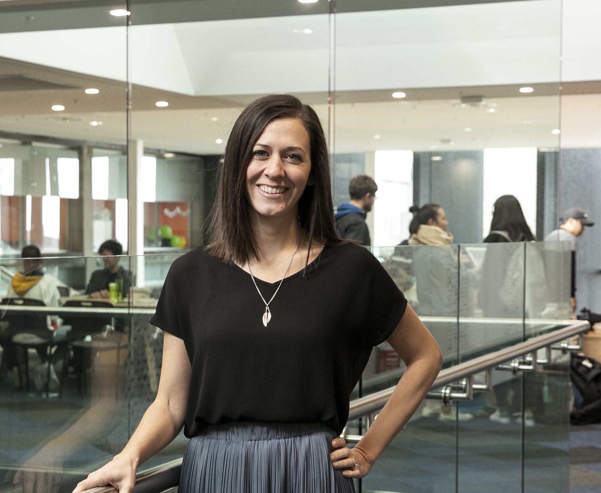

  

    

       
    

    
    
    <h1 class="text-primary">Kia Ora, Welcome</h1>

Abbas Heydarnoori has been a faculty member in <a href="https://ce.sharif.edu" target="_blank">the Department of Computer Engineering</a> at <a href="http://www.en.sharif.edu/" target="_blank">the Sharif University of Technology</a> since 2012. Before joining the Sharif University of Technology, he worked as a Software Engineer at Xtreme Labs Inc. (acquired by <a href="http://pivotal.io/" target="_blank">Pivotal</a>), Toronto, Canada in 2011. Before that, in 2010, he was a post-doctoral fellow in the <a href="http://www.inf.usi.ch/" target="_blank">Faculty of Informatics</a> at <a href="http://www.usi.ch/en/index.htm" target="_blank"> the University of Lugano</a>, Switzerland working with <a href="http://www.usi.ch/en/index.htm" target="_blank">Prof. Walter Binder</a>. He finished his PhD studies in 2009 under the supervision of Prof. Krzysztof Czarnecki in the School of Computer Science at the University of Waterloo, Canada. The details of his PhD research can be obtained from here. He also received his MSc and BSc degrees from the Department of Computer Engineering at the Sharif University of Technology, Iran in 2001 and 1999 respectively.

I am a Rutherford Discovery Fellow and a Senior Lecturer of Software Engineering at the University of Auckland, New Zealand in the Department of Electrical, Computer, and Software Engineering. I lead the Human Aspects of Software Engineering Lab (HASEL), check it out at <a href="https://hasel.auckland.ac.nz/" target="_blank">https://hasel.auckland.ac.nz</a>.  

My research is mainly in the human and social aspects of software engineering. My current research topics include: software dependencies, software ecosystems, collaborative software development, software requirements engineering, and software developer diversity and inclusion. My research is currently funded by a Royal Society Te Apārangi's Rutherford Discovery Fellowship, the Royal Society Te Apārangi's Marsden Fund, the National Science Challenges Science for Technological Innovation's Veracity Spearhead, and Google.  

<a href="/about.html" style="font-family: 'Homemade Apple', cursive; font-size: 150%;">More about Kelly</a>

